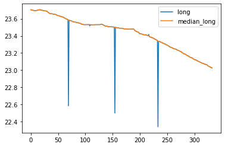

# EPA1352 - Advanced Simulation

**Assignment 1**

- Christiaan Ouwehand (4293053)
- Ewout ter Hoeven (4493346)
- Marlou Ceha (4691539)
- Timo Frazer (4579992)
- Zoé Huizing (4660455)

**The sturcture**

This repository contains three dictionaries:
 - `data`, with the raw, interim and processed data.
 - `images`, with the exported images supporting this report.
 - `notebook`, with the `Bridges.ipynb` and `Roads_EDA.ipynb` Jupyter Notebooks containing all code. HTML versions of the notebooks are also available to quickly look through.

The report continues below.

*All code is licensed under GNU General Public License v3, as described in `LICENSE` file.*

# Report

## 1. Data quality issues

To detect issues in the data, an exploratory data analysis (EDA) has been done on the road and bridge files which serve as input for the Java graphical visualizer. To identify outliers, histograms of the numerical columns were made from both files. According to Huang (2013), data quality issues can be categorized into three categories: syntactic, semantic, and pragmatic quality issues. In the following subsections, the findings of the EDA will be discussed and classified according to their quality issue category. No syntactical issue was detected.

### 1.1 Semantic quality issues

#### Semantic completeness

According to the bridge file, there are 3.193 bridges in Bangladesh. Up to 348 of them do not have a name, this makes it difficult for them to check if they have strange values (for example: a width larger than 67m). Also, some incompleteness has been detected in the longitude and latitude degrees and minutes have been detected of five different bridges. Some missing values are also present in 20 latitude seconds. This leads to inaccurate positioning of some bridges and will lead to mapping inconsistency.

#### Mapping consistency

In the road file there are several mapping quality issues. There are sufficient data points to trace a road through the map but the road is showing several deviation points. Figure 1 is showing the N1 of Bangladesh where several data points are showing inconsistent behavior. These are shown by the blue line in the figure. This kind of behavior is recognized for N, R, and Z roads. For Z roads this leads to completely horizontal or vertical road shapes.

Another mapping inconsistency is occurring in the bridges file: when visualized, there are several bridges included in the file that are localized outside of Bangladesh or in the sea. The bridges that are in the sea will be deleted. For the bridges outside Bangladesh the coordinates are switched, it is unclear if this is also the case for the second and the minute coordinates.



Figure 1: Road point deviation making road plots inconsistent

### 1.2 Pragmatic quality issues

#### Presentation precision

In the bridge file there is a need for recording the coordinates of every bridge. In the original file the coordinates are coded in different columns for the degree, the minutes, and the seconds. To identify wrong located bridges it is important to recode the coordinates into a variable with the following specificities:

(1) Coordinates = degree + minutes / 60 + seconds / 3600

By using Formula 1 a syntactic consistency issue is solved. Another encountered error in the bridge file is the construction year of the some bridges. When mapping out some bridges are constructed after 2022.

## 2. Designed solutions

Two components of the data were analysed, the road network in `_road.tcv` and the bridges in `Bridges.xlsx`.

### 2.1 Roads

For the road data, we executed the following steps:

- The `_road.tcv` was loaded into a Pandas DataFrame. In this dataframe, each row consisted of a road, with a large number of sequences of 3 columns containing the LRP name, latitude and longitude.
- We wrote a function `dataframe_per_road` in which each road was put into a separate dataframe. Each dataframe has 3 columns, one with all the LRP names, one with the latitudes and longitudes.

```python
def dataframe_per_road(single_row_df):
    # Create a series from the single-row dataframe
    series = single_row_df.iloc[0 , 1:]

    # Create an empty dataframe with 3 columns
    new_df = pd.DataFrame(columns=["name", "lat", "long"])

    # Fill that dataframe by splitting the series in sections of
    for i in range(len(series)//3):
        start = i*3
        end = (i+1)*3
        new_df.loc[i] = series.iloc[start:end].tolist()
    return new_df
```

- To detect the outliers in the longitude and latitude data, we decided to calculate rolling values for the median and standard deviation. The median doesn't change with a single large outlier, so it can be easily compared to outlier values.
- If the a values was more than 2 standard deviations from the 7-value rolling median value, we dropped it.
- The following function was written to do so. First a rolling median and standard deviation was calculated:

```python
def filter_all(df_dict, window=7, max_std=2):
    # This function takes as input a dictionary containing dataframes, a window
    # for the rolling median and a max std. deviation to select the road pieces.
    result = {}
    for r in roads['road']:
        road_df = df_dict[r]
        for a in ['lat', 'long']:
            # Add median and std values to dataframe
            road_df[f'median_{a}']= road_df[a].rolling(window, center=True, min_periods=2).median()
            road_df[f'std_{a}'] = road_df[a].rolling(window, center=True, min_periods=2).std()
        road_df2 = road_df.copy()
```

- Then, only the values within those 2 standard deviations of the mean are kept:

```python
        # Keep only the values that are withing the specified standard deviations of the rolling median
        for a in ['lat', 'long']:
            road_df2 = road_df2[
                (road_df2[a] < road_df2[f'median_{a}']+max_std*road_df2[f'std_{a}']) &
                (road_df2[a] > road_df2[f'median_{a}']-max_std*road_df2[f'std_{a}'])
            ]
```

- Finally, the `"LPRS"` and `"LPRE"` tags are added back to the first and last name of each road, to indicate the start and end of each road. This fixes an issue in which some roads looped back from their starting point to the end point.

```python
        # Replace the last value of each road to "LPRE"
        if len(road_df2.index) > 0:
            road_df2.loc[road_df2.index[0], 'name'] = "LPRS"
            road_df2.loc[road_df2.index[-1], 'name'] = "LPRE"

        result[r] = road_df2
    return result
```

- This resulted in roads for which short spikes in longitude and latitude were filtered by removing them.


- Then a function is used to strip all dataframes of the unnecessary columns and only keep the columns which were in the original .tcv file.

```python
def strip_dict(dic):
    '''This function strips the dataframnes in the dictionaries of unnecessary columns.'''
    result = {}
    for r in dic:
        df = dic[r]
        df1 = df.drop(columns=['median_long', 'median_lat', 'std_long', 'std_lat'])
        result[r] = df1
    return result
```

- Finally all dataframes in the dictionary are combined into one dataframe containing all the roads and making sure each row represents one road.

```python
# Create empty dictionary
series_to_add = {}

# Add a item to the dictionary for each road
for road, df in stripped.items():
    series_to_add[road] = df.stack()

# Create dataframe from dictionary, with each road being a column
new_df = pd.DataFrame.from_dict(series_to_add, orient="index")

# Drop multi-index level and transpose to get a row for each road
new_df = new_df.droplevel(level=0, axis=1)

# Export to TCV file
new_df.to_csv("../data/processed/_roads.tcv", sep="\t", index=True, line_terminator="\n")
```

The cleaned-up roads file is available in `data/processed/_roads.tcv`.

### 2.2 Bridges

The bridge data was analyzed and cleaned up from both a traditional data science perspective, as well as geospatially.

#### Traditional

For the bridges data, the following steps have been executed:

- The Bridges.xlsx file was loaded into a Pandas DataFrame. Every row consisted of information about the bridges. For example, the name, some characteristics about the bridge, the exact location and so on.
- Two new columns were add to the DataFrame to calculate the longitude and latitude according to formula (1)

```python=
Bridge['LongitudeDecimal'] = Bridge['LongitudeDegree'] + (Bridge['LongitudeMinute']/60) + (Bridge['LongitudeSecond']/3600)
Bridge['LatitudeDecimal'] = Bridge['LatitudeDegree'] + (Bridge['LatitudeMinute']/60) + (Bridge['LatitudeSecond']/3600)
```

- Since there were many duplicated bridged, we have dropped them and kept the first one.
- Also the bridges with missing values were dropped.
- In order to identify some outliers, the bridges were checked on their characteristics.
- Bridges with a width larger than 67 meters were dropped. Because the largest bridge of the world has a width of 67 meters (Road Traffic Technology, 2022).

```python=
Bridge = Bridge.dropna()
Bridge = Bridge.drop_duplicates()
Bridge_width = Bridge.loc[Bridge["TotalWidth"]>67]

# to drop bridges that are to large:
Bridge_widthindex = list(Bridge_width.index)
Bridge.drop(Bridge_widthindex, axis = 0, inplace = True)
```

- It was also checked if there were any strange outliers for the length of the bridges. But there were no odd values found here.
- Bridges with a construction year more recent than 2021 have been dropped.

```python=
ConstructionYear = Bridge.loc[Bridge["ConstructionYear"]>2021]
ConstructionYear_widthindex = list(ConstructionYear.index)
Bridge.drop(ConstructionYear_widthindex, axis = 0, inplace = True)
```

- Than there was also a bridge with a latitude an longitude that looked like they were switched around. This one also has been dropped because it was not clear whether only the `LatitudeDegree`  and `LongitudeDegree` had been swithed around or also the `LatitudeMinute` and `LatitudeSecond` had been swithed around with the one of the longitude.
- Al bridges that are in the sea are also droped, for that, a few coordinate frames were made:

- The resulting file was saved in `data/interim/Bridges.xlsx`.

#### Geospatially
Geospatially we analyzed which bridges were laying on the Bangladesh land area and which were outside it, either in other countries or on open water.

To do this, GeoPandas 0.10.2 and Contextily 1.2.0 were used.

- First a Bangladesh border file was prepared using ArcGIS Pro as an GeoJSON and imported in a GeoDataFrame.

```python
land = gpd.read_file("../data/raw/Bangladesh_border.json")
```
```python
Datatype of land: <class 'geopandas.geodataframe.GeoDataFrame'>
```

- The aim was check if the bridge was within 500 meters of Bangladesh land area. To do that, a [buffer](https://geopandas.org/en/stable/docs/reference/api/geopandas.GeoSeries.buffer.html) needed to be constructed around the land area.
- But before that was possible, the CRS (Coordinate Reference System) was converted from a Geographic CRS to Projected CRS. We choose to convert from `EPSG:4326` to `EPSG:3857`.

```python
land = land.to_crs(3857)
```

- The 500 meter buffer was added.

```python
buffer = 500 # meter
landb = land.buffer(buffer)
```

- The outputted buffer was a GeoSeries, which needed to be converted to a GeoDataFrame.

```python
landb = gpd.GeoDataFrame(geometry=gpd.GeoSeries(landb))
```

- Then the bridge data was loaded into a GeoDataFrame, using the decimal coordinates calculated earlier. Just like the land area, the dataframe was converted from Geographic CRS`EPSG:4326` to Projected CRS `EPSG:3857`.

```python
bridge_geo = gpd.GeoDataFrame(Bridge, geometry=gpd.points_from_xy(Bridge["LongitudeDecimal"], Bridge["LatitudeDecimal"]))
bridge_geo = bridge_geo.set_crs(4326)
bridge_geo = bridge_geo.to_crs(3857)
```

- Using the GeoPandas [sjoin](https://geopandas.org/en/stable/docs/reference/api/geopandas.sjoin.html) method with a [within](https://geopandas.org/en/stable/docs/reference/api/geopandas.GeoSeries.within.html) predicate, only the bridges inside the land area polygon are kept.

```python
kept_bridges = gpd.sjoin(bridge_geo, landb, predicate='within')
```

- We took a look at which bridges were dropped.

```python
dropped = bridge_geo[~bridge_geo.index.isin(kept_bridges.index)]
print(f'{len(dropped.index)} bridges are dropped: {", ".join(dropped["StructureName"].to_list())}.')
```
- 3 additional bridges are dropped: Khursukul Bridge, Shaplapur Bridge, Shari Bridge.
- Finally we created an map, to see which 3 bridges were removed and which were kept.

```python
# Setup figure and ax
f, ax = plt.subplots(1, figsize=(8, 8))

# Border, kept and dropped bridges
landb.plot(ax=ax, alpha=0.5, figsize=(8, 8))
kept_bridges.plot(ax=ax, alpha=0.5, color="green")
dropped.plot(ax=ax, alpha=0.5, color="red")

# Remove axis labels and ticks, keep them proportionate and add title
ax.set_axis_off()
ax.axis('equal')
ax.set_title(f'Bridges selected spatially in Bangladesh')

# Add a simple basemap of The Hague for visual reference
cx.add_basemap(ax, source=cx.providers.Stamen.TonerLite)
plt.savefig("../images/geospatial_plot_bridges.svg", dpi=200, bbox_inches='tight')
```


The resulting databases was exported back to Excel and is available in in `data/processed/Bridges.xlsx`.


## 3. Reflection

While looking at the original data file and making the EDA as a group we made the following assumption: the errors in the data were made by hand and did not have a inaccuracy issue based on missing values, stochastic inaccurate, or GPS variation. This made finding the errors quite difficult and let us think in a different way.

### 3.1 Roads


The water ways were inconsistent, some of the water ways were passing through land. A way to fix this was by assuming that every water way was passing through the middle of every river. From there a comparison algorithm could be made to compare the coordinates of the middle of the river and the existing water way.

### 3.2 Bridges

In the data cleaning the main focus was put on finding non existent bridges and remove them from the data. There was no time to analyze the overlap in information between the roads and bridge file. For that one or both of the following plans could be used:
 - The coordinate degree, minute, and second of roads could be rearranged with -+ 1 to better fit a potential bridge.
 - The geospatial buffers could be drawn around bridges, after which it could be compared if a road was within a certain radius of a bridge.

This is also an identification method to look at the bridges on the Bangladesh land. In the presented data cleaning all these bridges are presumed fitted on roads but this needs to be checked. This could be done by comparing the overlap in road and bridge coordinates.

## References:

 - Huang, Y., Automated Simulation Model Generation, Delft University of Technology, 2013, pp.44-52
 - Road Traffic Technology. (2014). Port Mann Bridge. https://www.roadtraffic-technology.com/projects/port-mann-bridgehighway-1-project/. Looked up on 2022, from www.roadtraffic-technology.com
